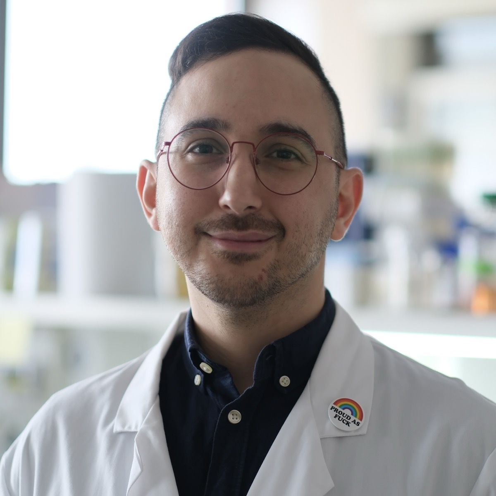

{.cv-photo fig-alt="Portrait of Constantinos Xenophontos"}

::: {.content-visible when-format="html"}
[<i class="bi bi-file-earmark-pdf"></i> Download PDF](Constantinos-Xenophontos-CV.pdf){.cv-download}
:::

<!-- The "\@" in the e-mail is required: after "_" Pandoc would otherwise parse
     "@outlook.com" as a citation key and Typst would fail with "no bibliography". -->
::: {.content-visible when-format="typst"}
::: {.cv-contact}
Postdoctoral researcher, IRCCS Humanitas Research Hospital, Milan\
[c_xen\@outlook.com](mailto:c_xen@outlook.com) · [orcid.org/0000-0001-9340-9566](https://orcid.org/0000-0001-9340-9566)\
[github.com/cxen](https://github.com/cxen) · [cxen.github.io](https://cxen.github.io)
:::
:::

<!-- Source of truth: ~/Documents/Academia/_. Curriculum Vitae/CV_Constantinos Xenophontos_v3.4.md
     (mirrored 2026-08-27). Referees are deliberately omitted from the public site. -->

## Employment

::::: {.columns .cv-entry}
::: {.column .cv-when width="16%"}
Since 2023
:::
::: {.column width="84%"}
**Postdoctoral researcher**, IRCCS Humanitas Research Hospital, Milan, Italy

[PI: Dr. Gabriele Micali, Microbial Ecology Lab]{.cv-detail}
:::
:::::

## Education

::::: {.columns .cv-entry}
::: {.column .cv-when width="16%"}
2016 – 2020
:::
::: {.column width="84%"}
**PhD researcher**, Friedrich Schiller University Jena & German Centre for Integrative Biodiversity Research (iDiv) Halle-Jena-Leipzig, Germany

[Dissertation: *Testing ecological theories with microbial communities*.]{.cv-detail}

[Supervisors: Prof. Dr. Kirsten Küsel, Prof. Dr. W. Stanley Harpole.]{.cv-detail}

<!-- TODO: add award year once the degree is conferred -->
:::
:::::

::::: {.columns .cv-entry}
::: {.column .cv-when width="16%"}
2014 – 2015
:::
::: {.column width="84%"}
**MRes Ecology, Evolution & Conservation** (Merit), Imperial College London, UK

[Thesis 1: *Variation in behaviour and resistance to fungal endoparasites between closely related clones of the anciently asexual rotifer Adineta vaga*.]{.cv-detail}

[Thesis 2: *Effects and interactions on phenotypic trajectories and metabolic activity of community bacteria*.]{.cv-detail}
:::
:::::

::::: {.columns .cv-entry}
::: {.column .cv-when width="16%"}
2010 – 2014
:::
::: {.column width="84%"}
**BSc (Hons) Biology** (2:1), University of Hull, UK

[Team research project in ecology, DNA barcoding and bioinformatics: *Is soil mesofauna abundance and diversity related to farming methods?*]{.cv-detail}
:::
:::::

## Publications

::: {#refs}
:::

The 2021 *FEMS Microbiology Ecology* article was selected as an
[Editor's Choice](https://twitter.com/FEMSmicro/status/1397832504518795267).

## Conference presentations

::::: {.columns .cv-entry}
::: {.column .cv-when width="16%"}
2026 May
:::
::: {.column width="84%"}
**Microfluidic Horizons 2026**, oral presentation

[*Stronger at the seams: antibiotic stress enhances amino acid leakage and cross-feeding.* Xenophontos C., Vaidyanathan A., Micali G.]{.cv-detail}
:::
:::::

::::: {.columns .cv-entry}
::: {.column .cv-when width="16%"}
2025 Dec
:::
::: {.column width="84%"}
**BES Annual Meeting 2025**, poster presentation

[*Stronger at the seams: antibiotic stress enhances amino acid leakage and cross-feeding.* Xenophontos C., Vaidyanathan A., Micali G.]{.cv-detail}
:::
:::::

::::: {.columns .cv-entry}
::: {.column .cv-when width="16%"}
2025 Jul
:::
::: {.column width="84%"}
**FEMS Micro 2025**, oral and poster presentations

[*Stronger at the seams: antibiotic stress enhances amino acid leakage and cross-feeding.* Xenophontos C., Vaidyanathan A., Micali G.]{.cv-detail}
:::
:::::

::::: {.columns .cv-entry}
::: {.column .cv-when width="16%"}
2020 Dec
:::
::: {.column width="84%"}
**ISME Virtual Microbial Ecology Summit**, poster presentation

[*Coexisting with cheaters: microbial cheating as a snowdrift game model.* Xenophontos C., Harpole W.S., Küsel K., Clark A.T. [doi:10.13140/RG.2.2.36728.26886](https://doi.org/10.13140/RG.2.2.36728.26886)]{.cv-detail}
:::
:::::

::::: {.columns .cv-entry}
::: {.column .cv-when width="16%"}
2019 Dec
:::
::: {.column width="84%"}
**BES Annual Meeting 2019**, oral presentation

[*Phylogenetic and functional dissimilarity have contrasting effects on the ecological functioning of synthetic bacterial communities.* Xenophontos C., Taubert M., Harpole W.S., Küsel K. [doi:10.13140/RG.2.2.16123.67361](https://doi.org/10.13140/RG.2.2.16123.67361)]{.cv-detail}
:::
:::::

::::: {.columns .cv-entry}
::: {.column .cv-when width="16%"}
2019 Sep
:::
::: {.column width="84%"}
**SAME16**, poster presentation

[*Species phylogenetic and functional diversity contribute to ecological functioning of groundwater bacterial communities.* Xenophontos C., Taubert M., Harpole W.S., Küsel K.]{.cv-detail}
:::
:::::

::::: {.columns .cv-entry}
::: {.column .cv-when width="16%"}
2019 Aug
:::
::: {.column width="84%"}
**5th iDiv Conference**, poster presentation

[*Species phylogenetic and functional diversity contribute to ecological functioning of groundwater bacterial communities.* Xenophontos C., Taubert M., Harpole W.S., Küsel K.]{.cv-detail}
:::
:::::

::::: {.columns .cv-entry}
::: {.column .cv-when width="16%"}
2018 Dec
:::
::: {.column width="84%"}
**4th iDiv Conference**, oral presentation

[*Species phylogenetic and functional diversity contribute to ecological functioning of groundwater bacterial communities.* Xenophontos C., Taubert M., Harpole W.S., Küsel K.]{.cv-detail}
:::
:::::

::::: {.columns .cv-entry}
::: {.column .cv-when width="16%"}
2018 Aug
:::
::: {.column width="84%"}
**ISME17**, poster presentation

[*Species phylogenetic and functional diversity contribute to ecological functioning of groundwater bacterial communities.* Xenophontos C., Taubert M., Harpole W.S., Küsel K.]{.cv-detail}
:::
:::::

::::: {.columns .cv-entry}
::: {.column .cv-when width="16%"}
2017 Sep
:::
::: {.column width="84%"}
**3rd iDiv Conference**, poster presentation

[*Shifts in ecological functioning of groundwater bacteria driven by species interactions.* Xenophontos C., Geesink P., Kumar S., Wegner C.-E., Harpole W.S., Küsel K. [doi:10.13140/RG.2.2.24728.49929](https://doi.org/10.13140/RG.2.2.24728.49929)]{.cv-detail}
:::
:::::

## Teaching and supervision

::::: {.columns .cv-entry}
::: {.column .cv-when width="16%"}
Since 2023
:::
::: {.column width="84%"}
Co-supervision of PhD and MSc students with Dr. Micali (lab work and data analysis), IRCCS Humanitas Research Hospital
:::
:::::

::::: {.columns .cv-entry}
::: {.column .cv-when width="16%"}
2019 May
:::
::: {.column width="84%"}
Soil DNA extraction and PCR practical course, Friedrich Schiller University Jena
:::
:::::

## Academic service

::::: {.columns .cv-entry}
::: {.column .cv-when width="16%"}
2026
:::
::: {.column width="84%"}
**Microfluidic Horizons 2026**, organising committee

[Social media and communications; session moderator]{.cv-detail}
:::
:::::

## Outreach

::::: {.columns .cv-entry}
::: {.column .cv-when width="16%"}
2023
:::
::: {.column width="84%"}
*Expo per lo Sport*, public event, Humanitas booth, Milan

[DNA-extraction instructor for children]{.cv-detail}
:::
:::::

::::: {.columns .cv-entry}
::: {.column .cv-when width="16%"}
2022
:::
::: {.column width="84%"}
*Holobiontinnen*, art performance exhibit, Leipzig ([LOFFT](https://www.lofft.de/en/programme/event/holobiontinnen), [Ballhaus Ost](https://www.ballhausost.de/holobiontinnen/?lang=en))

[Consulting microbiologist]{.cv-detail}
:::
:::::

::::: {.columns .cv-entry}
::: {.column .cv-when width="16%"}
2019
:::
::: {.column width="84%"}
*Long Night of Sciences*, public event, Jena

[Instructor, microbiology art for children]{.cv-detail}
:::
:::::

## Grants, awards and studentships

::::: {.columns .cv-entry}
::: {.column .cv-when width="16%"}
2023
:::
::: {.column width="84%"}
EMBO Postdoctoral Fellowship, shortlisted and interviewed; not funded
:::
:::::

::::: {.columns .cv-entry}
::: {.column .cv-when width="16%"}
2023
:::
::: {.column width="84%"}
HFSP Long-Term Fellowship, applied; not funded
:::
:::::

::::: {.columns .cv-entry}
::: {.column .cv-when width="16%"}
2019
:::
::: {.column width="84%"}
SAME16 conference travel grant
:::
:::::

::::: {.columns .cv-entry}
::: {.column .cv-when width="16%"}
2016
:::
::: {.column width="84%"}
yDiv Doctoral Programme studentship, German Centre for Integrative Biodiversity Research (iDiv) Halle-Jena-Leipzig
:::
:::::

## Societies

- International Society for Microbial Ecology (ISME), member
- Royal Society of Biology (RSB), member (MRSB)
- British Ecological Society (BES), member
- Federation of European Microbiological Societies (FEMS), affiliate member
- Society for Open, Reliable, and Transparent Ecology and Evolutionary biology (SORTEE), member

## Skills

<!-- Rewritten Sep 2026 from what the site already states (bio, Software page, CV).
     Diverges from the master CV's Skills list; port back if you keep it. -->

- **Experimental:** bacterial growth assays in 96-well plate readers, microfluidic timelapse microscopy, continuous-culture bioreactors, synthetic bacterial communities, DNA extraction and PCR
- **Computational:** R (tidyverse, Quarto), Python (marimo, Polars), Julia; growth-curve and dose–response analysis; image segmentation and cell tracking (Omnipose); Git and GitHub
- **Hardware and fabrication:** open-source bioreactor firmware (ChiBio); 3D printing and design (PrusaSlicer, BambuStudio, Fusion 360, Meshmixer)
