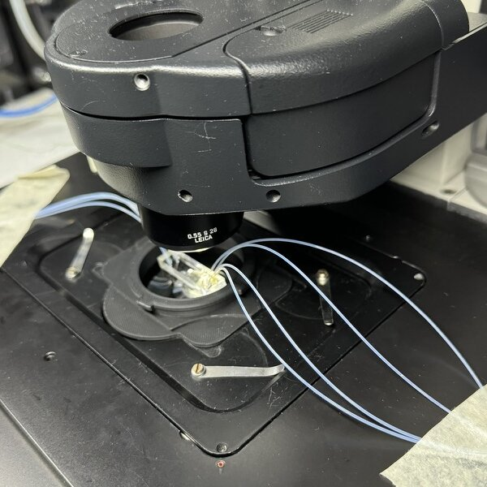

Parts I have designed for 3D printing, from lab hardware to printer and household
mods. Linked cards open the model page, where the files are free to download. All my
published models are on [Printables](https://www.printables.com/@Juvencus_113766/models)
and [MakerWorld](https://makerworld.com/en/@Juvencus/upload). Cards marked as not yet
published will be linked once the files are released.

::: {#designs}
:::

<!-- Extra photos for a card: assets/card-carousel.html moves these into a carousel on the
     card whose `image:` in designs.yml matches `data-for`. -->

::: {.card-extra-images data-for="images/designs/dmi8-stage-adaptor.jpg"}
{fig-alt="Side view of the adaptor in the stage insert beneath the microscope condenser, with tubing running from the microfluidic chip."}
:::
